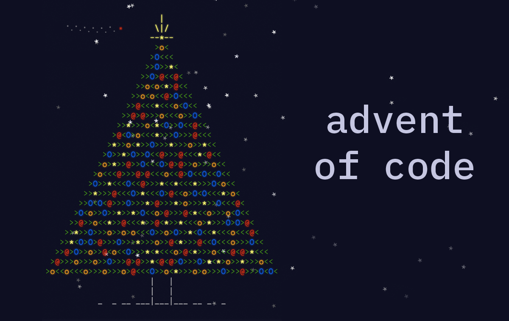

<!-- Banner -->

<p align="center">
  
</p>

 


# Advent of Code Solutions

Welcome to my solutions for the **Advent of Code** challenges. This repository contains code solutions to the daily coding puzzles of Advent of Code, an annual coding event.

## 🚀 Getting Started

Clone the repository:

```bash
git clone https://github.com/yourusername/advent-of-code.git
cd advent-of-code
```

## 🛠️ Running the Code

Ensure you have Node.js installed. To run a specific solution, navigate to the corresponding day folder and execute the script. For example:

```bash
node solution.js
```

## 📚 Challenge Solutions

| Day | Challenge                                   | Language   | Solution                          |
|-----|---------------------------------------------|------------|-----------------------------------|
| 1   | [Trebuchet?!](https://adventofcode.com/2023/day/1) | JavaScript | [Day 1 Solution](./2023/day01/solution.js)       |
| 2   | [Cube Conundrum](https://adventofcode.com/2023/day/2)                                 | JavaScript | [Day 2 Solution](./2023/day02/solution.js)       |
| ... |                                             |            |                                   |
## 🎯 Advent of Code

Check out the official [Advent of Code](https://adventofcode.com/) website for more information on the coding challenges.

---

<p align="center">Happy Coding! 🎄✨</p>
